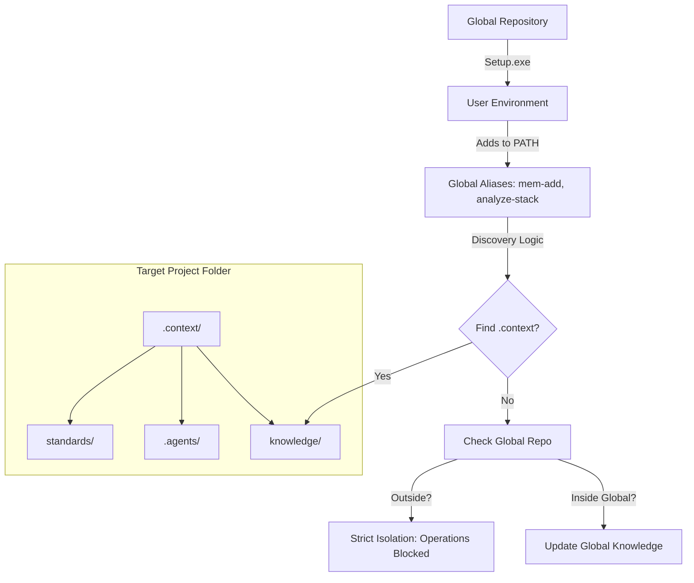
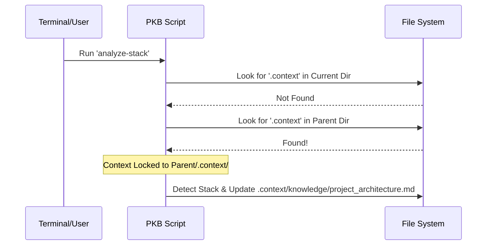

# Personal Knowledge Base & AI Meta-Repo (v1.0.0)

This repository serves as a centralized hub for AI workflows, persistent memory, and coding best practices. It is designed to be easily integrated into other projects to provide consistent context for AI assistants.

## Features

- **🧠 Persistent Memory**: Store successful research and implementation plans in `knowledge/`.
- **🤖 AI Workflows**: Pre-defined workflows for the Antigravity agent in `.agents/workflows/`.
- **📜 Standards**: Language-specific and architectural best practices in `standards/`.
- **💻 CLI Integration**: PowerShell scripts in `scripts/` for quick interaction.
- **🔍 Smart Tracking**: Automatically track project tech stacks and document architecture.
- **📄 Architecture Design**: Integrated detailed breakdown of discovery and memory logic.

## Getting Started

### Installation (Easy Method)
1. **Copy** the `personalKb` folder to your project root (or keep it central).
2. **Run** [Setup.exe](file:///c:/Users/allen/repos/personalKb/Setup.exe). This will add the tools to your PATH, set up PowerShell aliases, and optionally **clean up Git metadata** to prevent nested repository issues.

### Installation (Script Method)
If you prefer scripts, run the following from your project root:
```powershell
powershell -ExecutionPolicy Bypass -File "C:/Users/allen/repos/personalKb/scripts/Install-Context.ps1"
```

### CLI Commands
See [CLI Usage Guide](docs/cli_usage.md) for details on available commands:
- `Add-Memory`: Document a new finding.
- `Sync-TechStack`: Automatically update the project's tech context.
- `Find-Pattern`: Search local best practices.

## 🏛️ System Architecture

The core of the system is the relationship between the **Global Repository** and the **Target Project**.



## 🧠 Memory Storage Mechanism

Memory is stored as **standardized Markdown files**. This ensures that the knowledge is both human-readable and version-controllable (Git-friendly).

### The "Write" Flow (`Add-Memory`)
When you run `mem-add "Title" "Content"`:
1.  **Detection**: The `Get-ProjectRoot` script starts at your current folder and climbs up until it finds a `.context/` folder.
2.  **Versioning**: The script generates a slug-based filename: `yyyy-MM-dd-safe-title.md`.
3.  **Isolation**: 
    - If you are in `my-web-app` and it has a `.context/` folder, the file is saved to `my-web-app/.context/knowledge/memory/`.
    - If you are just in a random folder like `Desktop`, the script **refuses to write**, protecting you from creating "orphaned" memory.

## 🎯 Significance of `.context/`

The `.context/` directory is more than just a folder; it is a **Project-Specific Agent Brain**.

| Component | Purpose | Significance |
| :--- | :--- | :--- |
| `knowledge/` | Persistent Memory | Stores the "Why" and "How" of past technical decisions for that specific project. |
| `.agents/` | AI Directives | Contains the `instructions.md` that tell the AI to *check* the knowledge base before suggesting new code. |
| `standards/` | Local Rules | Overrides global standards with project-specific needs. |
| `scripts/` | Local Utilities | Provides tools that work specifically on the project's internal structure. |

## 🔄 The Discovery Algorithm

The PKB uses a recursive parent-search algorithm to find its home:



## 🔄 Keeping Projects Up to Date

Since nested installations usually lack Git metadata, use the **One-Click Update** method:

1. **Run** [Update.exe](file:///c:/Users/allen/repos/personalKb/Update.exe).
2. It will detect your GitHub source and refresh your scripts, agents, and standards.
3. Your project-specific `knowledge/` and `memory/` are preserved during the update.

## 🚀 Two-Layer Deployment

1.  **Global Layer (`Setup.exe`)**: Installs the "brain" and the "nerves" into your OS (PATH and PowerShell Profile). This makes the commands available everywhere.
2.  **Local Layer (`Install-Context.ps1`)**: "Initializes" a project. Once this is run, the project is "context-ready," and any AI working on it will immediately respect the PKB structures.

## Repository Structure
- `knowledge/`: Research files, implementation plans, and persistent AI memory.
- `.agents/`: Agent-specific instructions and automated workflows.
- `standards/`: Coding and architecture standards.
- `scripts/`: PowerShell utilities for automation.
