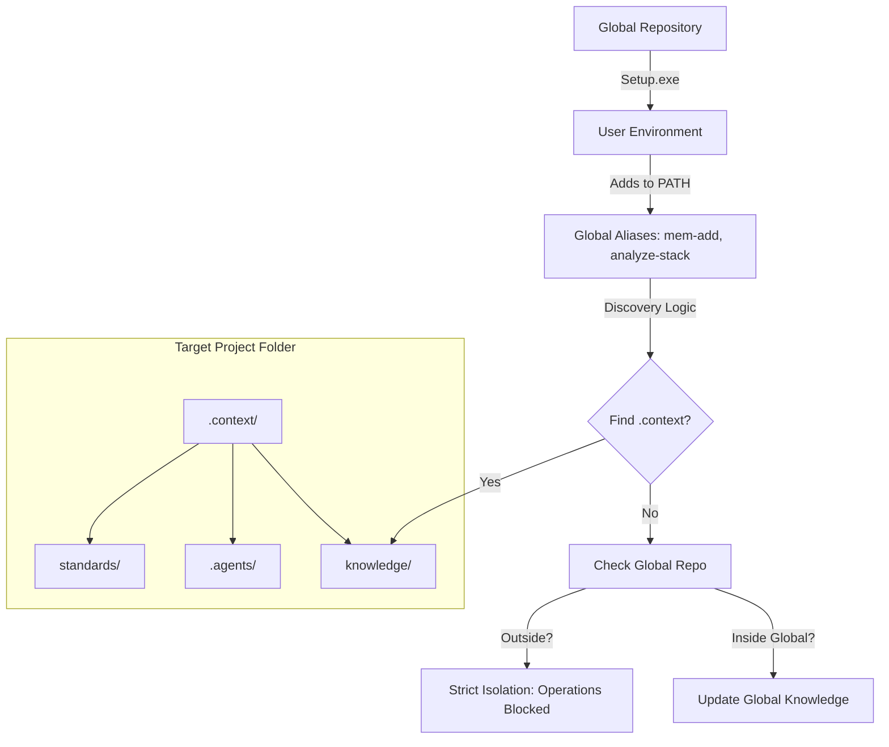
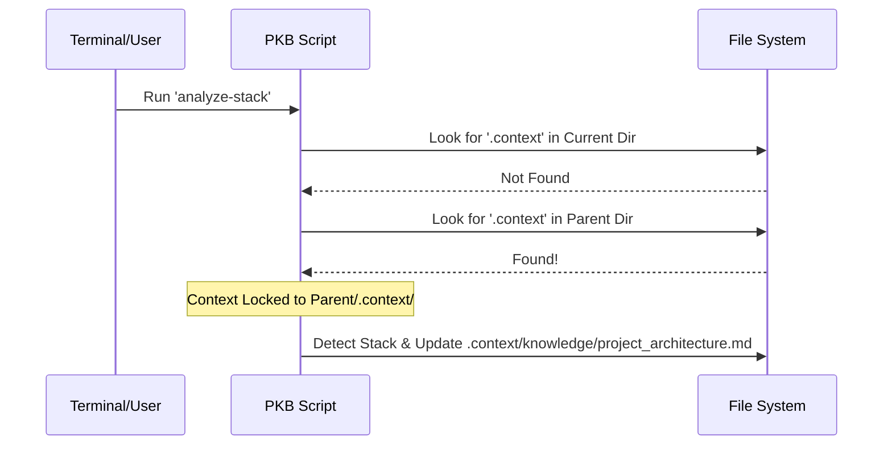

# Personal Knowledge Base & AI Meta-Repo (v1.0.0)

This repository serves as a centralized hub for AI workflows, persistent memory, and coding best practices. It is designed to be easily integrated into other projects to provide consistent context for AI assistants.

## Features

- **🧠 Persistent Memory**: Store successful research and implementation plans in `knowledge/`.
- **🔄 Auto-Retrospective**: Automatically analyze and document successes/failures after every agent action.
- **🤖 AI Workflows**: Pre-defined workflows for the Antigravity agent in `.agents/workflows/`.
- **📜 Standards**: Language-specific and architectural best practices in `standards/`.
- **💻 CLI Integration**: PowerShell scripts in `scripts/` for quick interaction.
- **🔍 Smart Tracking**: Automatically track project tech stacks and document architecture.

## Getting Started

### Installation (Easy Method)
1. **Copy** the `personalKb` folder to your project root (or keep it central).
2. **Run** [Setup.exe](file:///c:/Users/allen/repos/personalKb/Setup.exe). This will add the tools to your PATH, set up PowerShell aliases, and optionally **clean up Git metadata** to prevent nested repository issues.

### Installation (Script Method)
If you prefer scripts, run the following from your project root:
```powershell
powershell -ExecutionPolicy Bypass -File "C:/Users/allen/repos/personalKb/scripts/Install-Context.ps1"
```

### 🆕 Start a Project from Scratch
If you haven't even created a folder yet, you can scaffold a new project with the AI "brain" already installed:
```powershell
# From your parent 'repos' or 'projects' folder:
powershell -File "C:/Users/allen/repos/personalKb/scripts/New-Project.ps1" -Name "my-new-app"
```
This will:
1. Create the `my-new-app` folder.
2. Initialize Git.
3. Install the `.context/` directory and AI bootstrapping rules.

### CLI Commands
See [CLI Usage Guide](docs/cli_usage.md) for details on available commands:
- `Add-Memory`: Document a new finding manually.
- `Sync-TechStack`: Automatically update the project's tech context.
- `Invoke-Retrospective`: Manually trigger the historical context gathering.
- `Find-Pattern`: Search local best practices.

## 🏛️ System Architecture

The core of the system is the relationship between the **Global Repository** and the **Target Project**.



## 🧠 Memory Storage Mechanism

Memory is stored as **standardized Markdown files** with **YAML Frontmatter**. This ensures that the knowledge is human-readable, version-controllable (Git-friendly), and compatible with any LLM (Claude, GPT-4, Gemini) or IDE (Cursor, Windsurf, VS Code).

### The "Automatic" Flow (Agent Retrospective)
By default, the AI agent is programmed to perform a self-reflection after every task:
1.  **Reflection**: The agent runs `/retrospective` to analyze what worked and what didn't.
2.  **Context**: It uses `Invoke-Retrospective` to pull git logs and recent file changes.
3.  **Storage**: A new memory file is automatically saved with YAML metadata to `knowledge/retrospectives/`.

### The "Transfer" Flow (Local to Repo)
To bridge the gap between an agent's **temporary local brain** and the **permanent repo memory**, use the transfer workflow:
1.  **Run**: `scripts/Transfer-Memory.ps1` searches the local agent's knowledge storage.
2.  **Standardize**: It converts local "Knowledge Items" (KIs) into portable Markdown with YAML headers.
3.  **Persist**: The items are moved to `knowledge/ki/`, ready to be committed to Git.

### The "Manual" Write Flow (`Add-Memory`)
If you are working without an AI and want to save a quick note:
1.  **Detection**: The `Get-ProjectRoot` script starts at your current folder and climbs up until it finds a `.context/` folder.
2.  **Versioning**: The script generates a slug-based filename: `yyyy-MM-dd-safe-title.md`.
3.  **Isolation**: 
    - If you are in `my-web-app` and it has a `.context/` folder, the file is saved to `my-web-app/.context/knowledge/memory/`.
    - If you are just in a random folder like `Desktop`, the script **refuses to write**, protecting you from creating "orphaned" memory.

## 🎯 Significance of `.context/`

The `.context/` directory is more than just a folder; it is a **Project-Specific Agent Brain**.

| Component | Purpose | Significance |
| :--- | :--- | :--- |
| `knowledge/` | Persistent Memory | Stores the "Why" and "How" of past technical decisions for that specific project. |
| `.agents/` | AI Directives | Contains the `instructions.md` that tell the AI to *check* the knowledge base before suggesting new code. |
| `standards/` | Local Rules | Overrides global standards with project-specific needs. |
| `scripts/` | Local Utilities | Provides tools that work specifically on the project's internal structure. |

## 🤝 AI Agent Discovery & Bootstrapping

This repository is "AI-Native." We ensure your AI assistant is ready to help from the very first prompt:

### Auto-Bootstrapping (Cursor, Windsurf, Cliner)
When you run `Install-Context.ps1`, it automatically drops `.cursorrules`, `.windsurfrules`, and `.clinerules` into your project root. These files tell the AI to **immediately scan** the `.context/knowledge/` directory as soon as the project is opened.

### Manual Bootstrapping (For other AIs)
If you are using a tool that doesn't support auto-loading rules, simply paste this **Kickstart Prompt** as your first message:
> *"Please read `.context/knowledge/README.md` to understand our project's long-term memory and architectural patterns before we begin."*

## 🔄 The Discovery Algorithm

The PKB uses a recursive parent-search algorithm to find its home:



## 🤝 AI Agent Discovery

This repository is "AI-Native." When a new AI assistant opens this project:
-   It is greeted by [knowledge/README.md](knowledge/README.md), which explains how to use the existing memory.
-   It can load the [Long-Term Memory](knowledge/) to immediately understand past decisions, avoiding redundant research.
-   It follows the standardized [Transfer Workflow](.agents/workflows/transfer-memory.md) to keep the memory evergreen.

## 🚀 Installation & Update

1.  **Global Layer (`Setup.exe`)**: Installs the "brain" and the "nerves" into your OS (PATH and PowerShell Profile). This makes the commands available everywhere.
2.  **Local Layer (`Install-Context.ps1`)**: "Initializes" a project. Once this is run, the project is "context-ready," and any AI working on it will immediately respect the PKB structures.

## Repository Structure
- `knowledge/`: Research files, implementation plans, and persistent AI memory.
- `.agents/`: Agent-specific instructions and automated workflows.
- `standards/`: Coding and architecture standards.
- `scripts/`: PowerShell utilities for automation.
