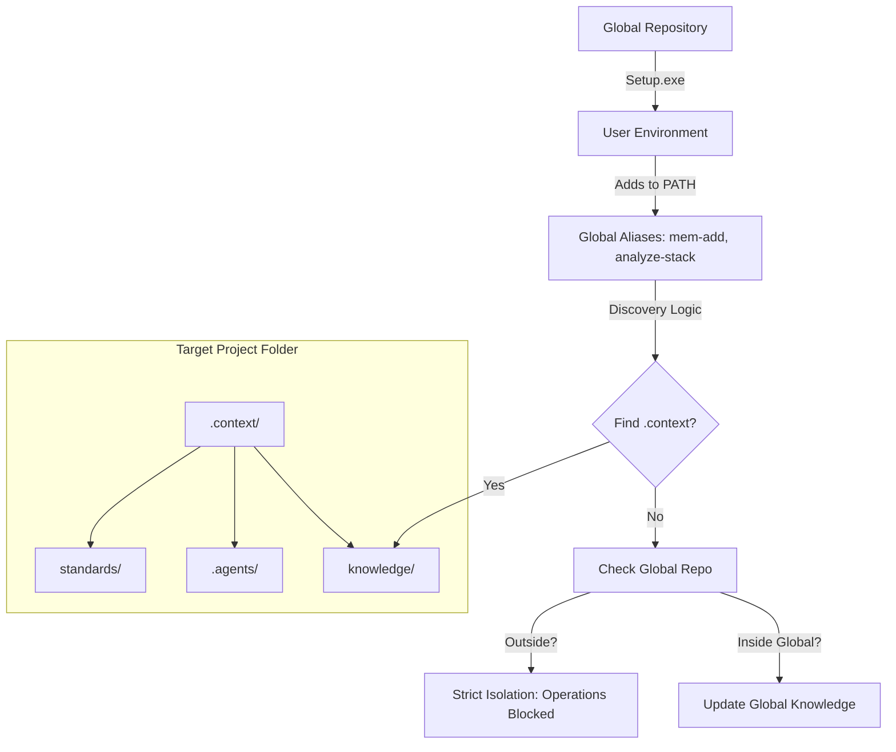
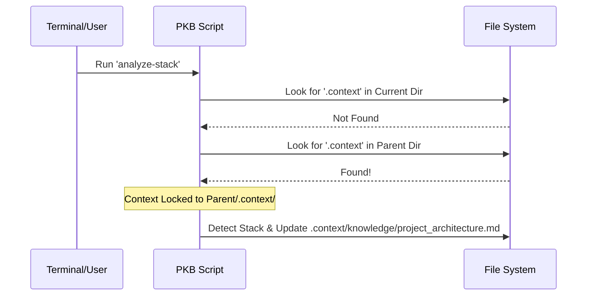

# Project Architecture: Personal Knowledge Base (PKB)

The Personal Knowledge Base is a **meta-context layer** designed to bridge the gap between global standards and project-specific memory. It uses a "Strict Isolation" discovery logic to ensure that your research and findings are always stored in the correct project bucket.

## 🏛️ System Architecture

The core of the system is the relationship between the **Global Repository** and the **Target Project**.

## 🧠 Memory Storage Mechanism

Memory is stored as **standardized Markdown files**. This ensures that the knowledge is both human-readable and version-controllable (Git-friendly).

### The "Write" Flow (`Add-Memory`)
When you run `mem-add "Title" "Content"`:
1.  **Detection**: The `Get-ProjectRoot` script starts at your current folder and climbs up until it finds a `.context/` folder.
2.  **Versioning**: The script generates a slug-based filename: `yyyy-MM-dd-safe-title.md`.
3.  **Isolation**: 
    - If you are in `my-web-app` and it has a `.context/` folder, the file is saved to `my-web-app/.context/knowledge/memory/`.
    - If you are just in a random folder like `Desktop`, the script **refuses to write**, protecting you from creating "orphaned" memory.

## 🎯 Significance of `.context/`

The `.context/` directory is more than just a folder; it is a **Project-Specific Agent Brain**.

| Component | Purpose | Significance |
| :--- | :--- | :--- |
| `knowledge/` | Persistent Memory | Stores the "Why" and "How" of past technical decisions for that specific project. |
| `.agents/` | AI Directives | Contains the `instructions.md` that tell the AI to *check* the knowledge base before suggesting new code. |
| `standards/` | Local Rules | Overrides global standards with project-specific needs. |
| `scripts/` | Local Utilities | Provides tools that work specifically on the project's internal structure. |

## 🔄 The Discovery Algorithm

The PKB uses a recursive parent-search algorithm to find its home:

## 🚀 Two-Layer Deployment

1.  **Global Layer (`Setup.exe`)**: Installs the "brain" and the "nerves" into your OS (PATH and PowerShell Profile). This makes the commands available everywhere.
2.  **Local Layer (`Install-Context.ps1`)**: "Initializes" a project. Once this is run, the project is "context-ready," and any AI working on it will immediately respect the PKB structures.
